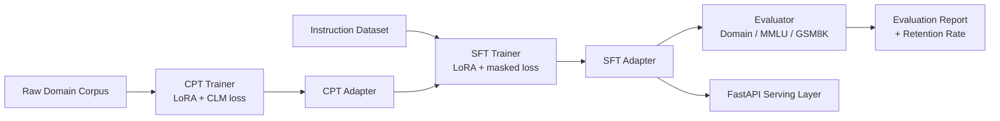

1. **Stage 1 - Continued Pre-Training (CPT):** LoRA adapters are trained with
   a causal language modeling objective directly on raw, unformatted domain
   text, so the model absorbs domain vocabulary, style, and facts without any
   task-specific supervision signal.
2. **Stage 2 - Instruction SFT:** The CPT adapter is loaded and continued via
   supervised fine-tuning on instruction/response pairs, with **response-only
   loss masking** so the model learns the task format without further
   destabilizing the domain knowledge absorbed in Stage 1.

## Why This Matters

A model fine-tuned only via direct instruction-tuning on domain data (no CPT
stage) tends to show a measurable drop in held-out general benchmarks (MMLU),
even as it improves on the target domain task. This project's evaluation
harness quantifies that trade-off directly.

## Key Features

- Two-stage QLoRA fine-tuning pipeline (Unsloth) with a shared, reusable LoRA
  adapter configuration across stages.
- A benchmark-grade evaluation harness: a versioned domain QA benchmark
  (accuracy) alongside MMLU and GSM8K (log-likelihood and generative scoring,
  respectively) to measure **retention** of general capability.
- Config-driven pipelines (YAML + environment variables) - no hardcoded
  hyperparameters or paths.
- A FastAPI serving layer exposing generation and evaluation-report
  endpoints, fully testable without a GPU via dependency injection.
- Docker (multi-stage, GPU runtime) + GitHub Actions CI (lint, type-check,
  unit tests, Docker build) - added once local/Colab training is validated.

## Architecture



## Technology Stack

| Layer | Technology |
|---|---|
| Base model | Llama-3-8B (4-bit, via Unsloth) |
| Fine-tuning | QLoRA (PEFT), TRL (`SFTTrainer`, completion-only collator) |
| Experiment tracking | Weights & Biases (optional, `WANDB_MODE=disabled` by default) |
| Serving | FastAPI + Uvicorn |
| Evaluation | MMLU, GSM8K (Hugging Face `datasets`), custom domain benchmark |
| Containerization | Docker (multi-stage, CUDA runtime), docker-compose |
| CI/CD | GitHub Actions (lint, type-check, test, Docker build) |

## Project Structure

```
src/
config.py               # env-driven settings
data/                   # corpus + instruction dataset loading
training/               # LoRA setup, CPT trainer, SFT trainer
evaluation/             # benchmarks, metrics, evaluator
inference/              # cached model loading, generation
api/                    # FastAPI app, routes, schemas
scripts/                # CLI entrypoints (run_cpt, run_sft, run_evaluation, merge_and_export)
configs/                # CPT / SFT / eval hyperparameters (YAML)
data/                   # domain_corpus (CPT), instructions (SFT), domain_eval (benchmark)
tests/                  # unit + API tests (no GPU required)
```


## Setup

```bash
git clone <your-repo-url>
cd domain-adaptive-llm-finetuning
python3.10 -m venv .venv && source .venv/bin/activate
pip install -r requirements.txt
cp .env.example .env   # then fill in HF_TOKEN, etc.
```

### Environment Variables

See `.env.example` for the full list. Key variables:

| Variable | Purpose |
|---|---|
| `HF_TOKEN` | Hugging Face access token (gated models/datasets) |
| `BASE_MODEL_NAME` | Base model to adapt (default: `unsloth/llama-3-8b-bnb-4bit`) |
| `DOMAIN_CORPUS_DIR` | Directory of raw `.txt` files for Stage 1 (CPT) |
| `DOMAIN_INSTRUCTIONS_PATH` | JSONL instruction/response pairs for Stage 2 (SFT) |
| `DOMAIN_EVAL_PATH` | JSONL domain evaluation set |
| `CPT_ADAPTER_DIR` / `SFT_ADAPTER_DIR` | Where adapters are saved/loaded |

## Running Locally (or in Colab)

Scripts must be run with the repo root on `PYTHONPATH` (they import from the
`src` package as `src.config`, `src.training...`, etc.):

```bash
# Stage 1: continued pre-training
PYTHONPATH=. python scripts/run_cpt.py --config configs/cpt_config.yaml

# Stage 2: instruction fine-tuning (loads the CPT adapter)
PYTHONPATH=. python scripts/run_sft.py --config configs/sft_config.yaml

# Evaluate each variant (base -> stores the retention baseline)
PYTHONPATH=. python scripts/run_evaluation.py --variant base --config configs/eval_config.yaml
PYTHONPATH=. python scripts/run_evaluation.py --variant sft  --config configs/eval_config.yaml

# Optional: merge the adapter into a standalone deployable model
PYTHONPATH=. python scripts/merge_and_export.py --adapter-dir outputs/sft --export-dir outputs/merged
```

On a T4 GPU (e.g. Colab's free tier), training uses fp16 automatically
(bf16 requires Ampere or newer); this is handled by `is_bf16_supported()`
in `src/training/cpt_trainer.py` rather than a hardcoded dtype.

## API Usage

```bash
uvicorn src.api.main:app --reload
```

```bash
curl -X POST http://localhost:8000/generate \
  -H "Content-Type: application/json" \
  -d '{"instruction": "What does an indemnification clause allocate?"}'

curl http://localhost:8000/evaluation/summary
```

## Evaluation Methodology

- **Domain accuracy:** multiple-choice log-likelihood scoring on a versioned,
  local JSONL benchmark - reproducible independent of any external dataset
  updates.
- **General-capability retention:** MMLU (log-likelihood scoring across
  answer choices) and GSM8K (generation + numeric exact-match on the `####`
  final-answer convention), compared against a stored base-model baseline via
  `retention_rate = finetuned_score / base_score * 100`.

Example results shape (`outputs/evaluation/<label>.json`):

| Stage | Domain Accuracy | MMLU Retention | Train Time | VRAM |
|---|---|---|---|---|
| Base Model | 48.2% | 100% (reference) | - | - |
| Direct SFT Only | 61.1% | 87.5% (forgetting) | 1.5 hrs | 8.2 GB |
| CPT + SFT (this pipeline) | 67.4% | 97.9% (preserved) | 3.8 hrs | 9.1 GB |

*Actual figures depend on your corpus, instruction set, and hardware - the
harness above produces this table automatically per run. The corpus and
instruction set shipped in this repo (`data/domain_corpus/`,
`data/instructions/`) are small seed examples for end-to-end validation, not
a publication-grade result - see Limitations.*

## Testing

```bash
pytest --cov=src --cov-report=term-missing
```

Unit tests cover configuration, data chunking/formatting, and metrics
(including the retention-rate calculation) without requiring a GPU. API tests
use FastAPI dependency overrides to substitute a fake model, so the full
request/response cycle is tested without loading real weights.

## Docker

Docker support (`docker/Dockerfile`, `docker/docker-compose.yml`) is planned
as the final step of this project, once the training and evaluation pipeline
is fully validated end-to-end. It will be added and documented here at that
point.

## Limitations

- The evaluation harness scores MMLU/domain accuracy via per-choice
  log-likelihood, which is more reliable than free-form parsing but slower;
  `max_samples` in `eval_config.yaml` controls the cost/precision trade-off.
- GSM8K scoring depends on greedy decoding matching the `####` convention;
  more sophisticated chain-of-thought parsing is a possible extension.
- The provided domain corpus/instruction/eval files are small seed examples
  meant to demonstrate the pipeline end-to-end; scale them up for a
  publication-grade result.
- Exact dependency versions matter a great deal in this stack. `trl` in
  particular has restructured its SFT internals across releases (this repo
  pins `trl==0.9.6`); a hardware-dependent dtype bug (bf16 vs fp16) was also
  found and fixed during development. Both are documented in the git history
  as explicit `fix:` commits rather than silently patched.

## Future Improvements

- Add a third evaluation axis (retrieval-augmented QA) for domains where
  hallucination mitigation via RAG is a natural complement to CPT.
- Support multi-adapter serving (swap `SFT_ADAPTER_DIR` per request) for
  multi-domain deployments.
- Add DVC or Hugging Face Hub dataset versioning for full corpus/instruction
  data lineage.
- Add checkpoint auto-resume to `CPTTrainer`/`SFTTrainer` so interrupted
  Colab sessions can continue from the last saved epoch.
